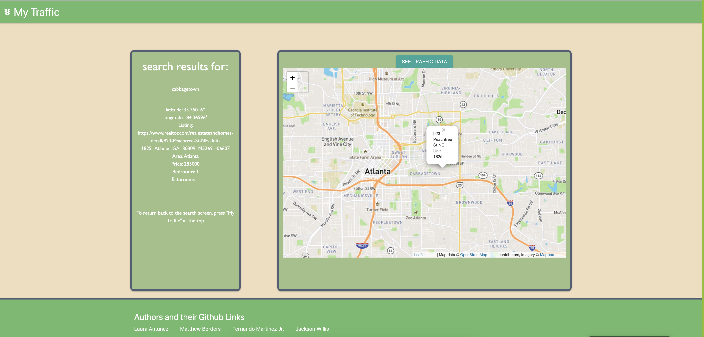
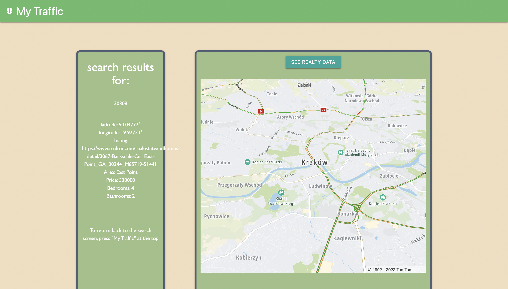

# Project 01: My Traffic

## Description

Our mission with this application is to show potential homeowners the traffic around the listings they are interested in.

## How?
 
 The "How?" is very easy you just simply put in your city or zipcode and our application will show you a traffic map with the area listings to the side so you can see how brutal your commute might be!

## Technologies used

Materialize: https://materializecss.com/

Tomtom API: https://developer.tomtom.com/blog/build-different/using-traffic-data-maps-and-routes

## Screenshot

## Check it out!

link: file:///Users/jacksonwillis/Documents/01-Github-Projects_/My-Traffic/index.html

## Contributers

Matthew Borders: https://github.com/MRBorders

Fernando Martinez Jr.: https://github.com/FMartinez59

Laura Antunez: https://github.com/lauraantunez024

Jackson Willis: https://github.com/Jacksonwillis22