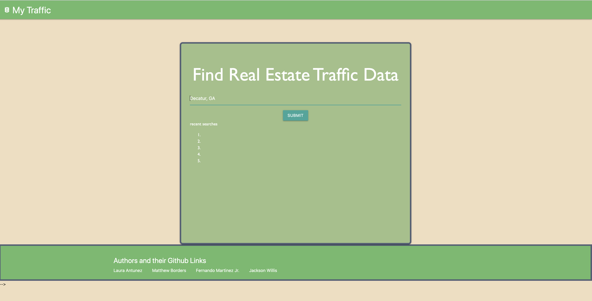

# Project 01: My Traffic

## Description

Our mission with this application is to show potential homeowners the traffic around the listings they are interested in.

## How?
 
A user puts an Atlanta, GA area, for example, Decatur, GA, and they will first be presented with a live traffic map of that area. When they click "see realty data" they will see a leaflet map populated with a listing in that area. 
This are for people who are considering moving to Atlanta and want to know what the traffic is like in certain areas, as well as examples of listing of houses for sale in that area.

The code works by using both a TomTom API and a realty in us Api. The TomTom API takes the user input and shows that area, the realty api populates a leaflet map with a listing, as well as some information about the listing.

## Technologies used

Materialize: https://materializecss.com/
Leaflet JS https://leafletjs.com/
Realty API https://apidojo.github.io/#realtor-api
Tomtom API: https://developer.tomtom.com/blog/build-different/using-traffic-data-maps-and-routes

## Screenshot

## Check it out!

link: https://lauraantunez024.github.io/My-Traffic/

## Contributers

Matthew Borders: https://github.com/MRBorders

Fernando Martinez Jr.: https://github.com/FMartinez59

Laura Antunez: https://github.com/lauraantunez024

Jackson Willis: https://github.com/Jacksonwillis22